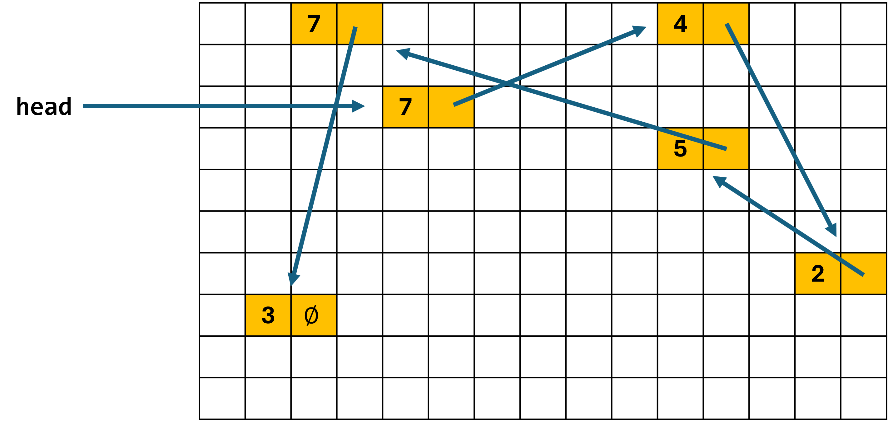
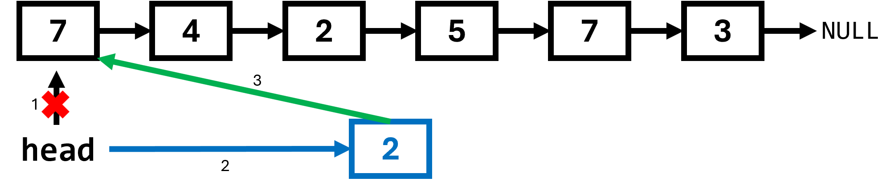
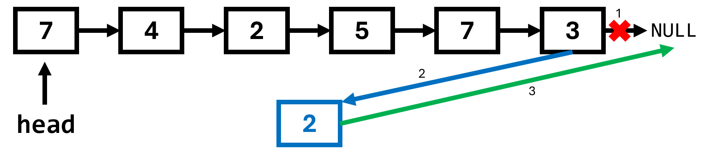
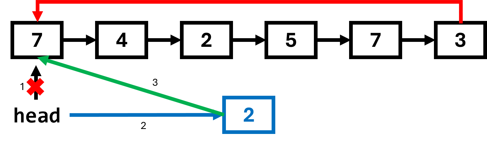
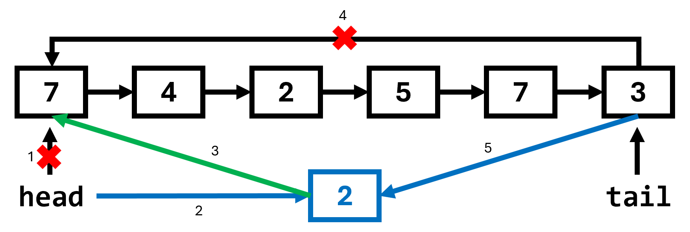
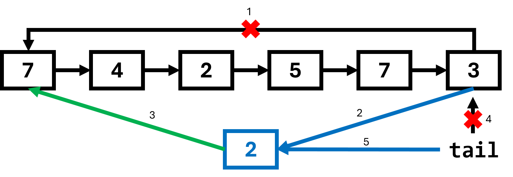

# `LinkedList` Review
## The Memory Picture
Recall that a `LinkedList` implements the `List` interface by distributing data across memory in so many *nodes*.
Each *node* consists of a *data* payload and a *link* to the next node.
The link in the last node is given a null value, i.e. it points nowhere.
Meanwhile, the `LinkedList` object itself simply contains a link - call it `head` - to the *first* node.
Any data value in the list can be accessed by starting from the head and traversing the list one node at a time.

## Linked List Diagrams
The data in a `LinkedList` is generally distributed haphazardly throughout memory.
It is common to diagram a `LinkedList` by drawing just the nodes, abstracting out all the memory space between the nodes.

These diagrams make it a bit easier to see how different `LinkedList` operations work.
For example, an *insertion* might be drawn like this:

This diagram concisely summarizes the three steps for a typical insertion.
1. Remove the connection from the preceding node to the subsequent node.
2. Connect the preceding node to a new node containing the data you wish to insert.
3. Connect the new node to the subsequent node.

## Efficient Prepend
An insertion at the *start* of the list, i.e. at index 0, is known as the *prepend* operation.
Your implementation of `insert` must handle this case separately, because there is no preceding node.
Instead, it is the `head` variable, the instance variable tracked by the `LinkedList` itself, which must be re-routed.

Crucially, this operation does not require traversing the list at all, meaning it can be completed in O(1) runtime.

## Inefficient Append
An insertion at the *end* of the list, i.e. at index `n` if the list has `n` elements, is known as the *append* operation.
You must carefully consider how to handle this case also, because there is no subsequent node.

Actually, it is very likely your implementation of `insert` does not need a separate case for appending, because simply using the value of `null` for the subsequent node will result in the desired behavior.

Appending to a list is one of the most intuitive and common list operations.
However, it is not efficient for a `LinkedList`, because you need to traverese the entire list before you can update the link on the last node.

# The `CircularLinkedList`
## One More Link
We now introduce a new data structure, very similar to the LinkedList but with one structural difference: the last node no longer links to NULL, but *back to the first node*.
Thus, the diagram forms a sort of cycle - or, you might say, a circle.

## Efficient Prepend
Consider what it takes to *prepend* to a `CircularLinkedList`.
If we follow the same steps that we do for the `LinkedList`, updating `head` and creating a new node which links to the original head, we get this diagram:

We aren't finished! *We have to update the link on the last node.*
But as we saw with the `LinkedList`, updating the link on the last node is not efficient.
We would have to traverse through the entire list.

The `CircularLinkedList` data structure resolves this issue by adopting the *last* node as a link stored by the `CircularLinkedList` object itself.
We call it the `tail` rather than the `head`.

Now we have immediate access to the last node, so we can complete our prepend operation in constant O(1) time.

In fact, for a `CircularLinkedList`, if we have O(1) access to the tail, then we also have O(1) access to the head via `tail.link`.
**We never needed to track the `head` at all.**

## Efficient Append
In the previous section, we saw that retaining an efficient prepend operation in the 
But since we have access to the end of the list, we can now easily *append* as well.

In fact, the structure of a `CircularLinkedList` is identical whether we *prepend* or *append*.
The *only* difference between the last two pictures is that, when appending, we update the `tail` maintained by `CircularLinkedList` itself.